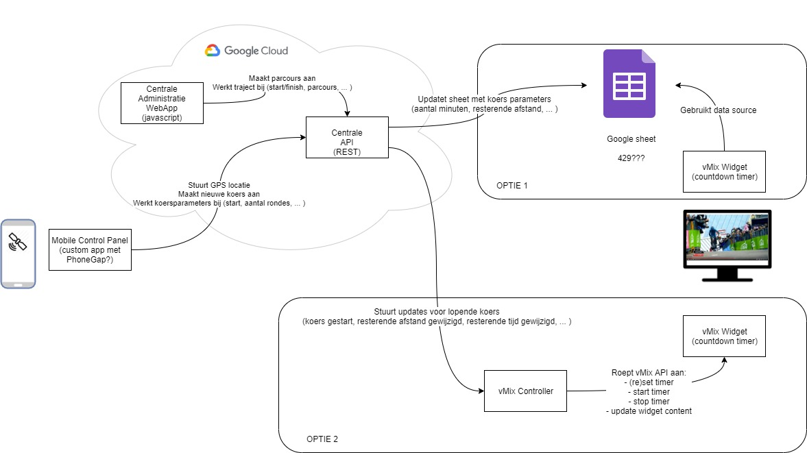

# kermiskoers

Written against node v8.11.3. 

The goal of this project is to achieve what is described in the following diagram.

To run:
- install node v8.11.3 (https://nodejs.org/download/release/v8.11.3/)
- download code from https://github.com/eXnOf/kermiskoers (or use git source control to clone the repo locally; install git from https://git-scm.com/book/en/v2/Getting-Started-Installing-Git, go into a chosen directory and type "git clone https://github.com/eXnOf/kermiskoers.git")
- go into the kk-backend folder and run "DEBUG=kk-backend:* npm start" (or just npm start if that's not working).
- open your browser @ "http://localhost:3000"

To fix access/credential errors:
- frontend maps javascript API key error => generate a new API key for the GCP (Google Cloud Platform - under "APIs & Services"/Credentials, using "Create Credentials") with access to "Maps Javascrtip API" only, copy the key into the index.html source code (at the time of writing)
- backend error: Unable to detect a Project Id in the current environment => Google Datastore API is used to store the parcours entities, you will need to
  1. create new JSON key for the GCP Service Account (IAM & Admin/Service Accounts)
  2. enable this key by adding it to your current session's environment variables, e.g. export GOOGLE_APPLICATION_CREDENTIALS="/c/GitHub/kermiskoers/KermisKoersPOC-5fe0c362f61f.json"

To test the current version of the application:
- on top of the map, select the "Polyline" tool
- draw a polygon by clicking different points on the map. Either click the starting point to close the line and create a loop, or double-click somewhere on the map to define an endpoint
- next, pick the "Marker" tool
- click somewhere near the polygon you created (you will notice the point is snapped to the polygon); you now defined the start/finish
- subsequent clicks will evaluate a gps coordinate:
    - Push F12 (developer tools) and find the console output
    - click a few times near various parts of the polygon; you should see the results of the calculations in the API coming back
